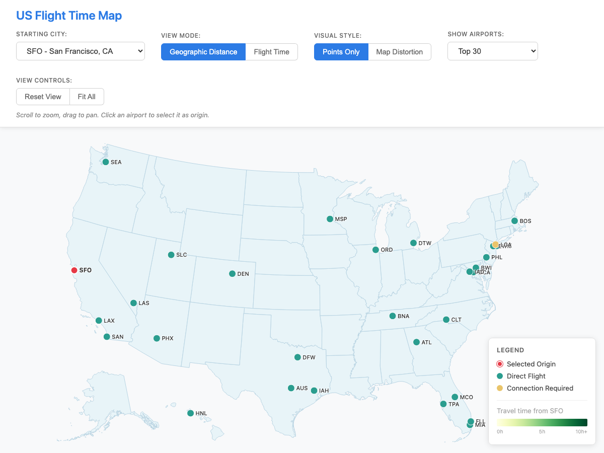

# As The Plane Flies

An interactive visualization that reveals how air travel reshapes our perception of distance across the United States.



## The Concept

Geographic distance doesn't equal travel time. A city 500 miles away might be quicker to reach than one 200 miles away, depending on flight routes and hub connections. This visualization makes that disconnect tangible by morphing the US map based on actual flight times from any selected origin airport.

**Key insight:** Watch how major hubs like Atlanta, Denver, and Dallas "pull" closer to your origin, while poorly-connected cities drift further away—regardless of where they sit on a traditional map.

## Features

- **Two view modes:**
  - *Geographic Distance* — Standard US map
  - *Flight Time* — Map distorts to show travel time as distance

- **Visual indicators:**
  - Solid dots = Direct flights available
  - Ring outlines = Connection required
  - Color gradient = Travel time (yellow → red)

- **Interactive elements:**
  - Click any airport to set as origin
  - Hover for travel time details
  - Curved dotted line shows route on hover
  - Pan and zoom controls

- **Smart UX:**
  - URL updates for sharing (e.g., `?origin=SFO`)
  - Press Escape to deselect origin
  - "Closest by air vs. closest on map" insight in legend
  - Tooltips stay on screen near edges

## Data

Flight times are calculated from real Bureau of Transportation Statistics (BTS) On-Time Performance data:
- 10 months of data (January–October 2024)
- ~4.7 million flights processed
- Top 100 US airports (excluding Hawaii, Alaska, Puerto Rico)
- Times represent gate-to-gate duration for direct flights
- Connection times estimated using shortest path through major hubs

## Tech Stack

- **D3.js v7** — Visualization and map projection
- **TopoJSON** — US state boundaries
- **Vanilla JavaScript** — No framework dependencies
- **Playwright** — End-to-end testing

## Getting Started

### Prerequisites

- Node.js (v16 or higher)
- npm

### Installation

```bash
# Clone the repository
git clone https://github.com/brandonmburroughs/as-the-plane-flies.git
cd as-the-plane-flies

# Install dependencies
npm install
```

### Running Locally

```bash
# Start the development server
npm run serve
```

Then open [http://localhost:3000](http://localhost:3000) in your browser.

### Running Tests

```bash
# Run all tests
npm test

# Run tests with UI
npm test:ui

# Run tests in headed mode (see browser)
npm test:headed
```

## Project Structure

```
as-the-plane-flies/
├── css/
│   └── styles.css          # All styling
├── data/
│   ├── airports.json       # Top 100 US airports
│   └── matrix.json         # Travel time matrix (from BTS data)
├── js/
│   ├── algorithms/
│   │   ├── mds.js          # Radial distortion algorithm
│   │   └── meshDeformer.js # Mesh deformation utilities
│   ├── data/
│   │   └── dataLoader.js   # Data fetching and caching
│   ├── ui/
│   │   ├── controls.js     # UI control handlers
│   │   └── legend.js       # Legend rendering
│   ├── visualization/
│   │   ├── mapRenderer.js  # Main orchestrator
│   │   ├── pointsMode.js   # Points-only visualization
│   │   ├── rubberSheetMode.js  # Map distortion mode
│   │   └── transitionManager.js # Animation handling
│   ├── app.js              # Application entry point
│   └── config.js           # Configuration constants
├── scripts/
│   └── data-pipeline/
│       ├── generate-matrix.js    # Generate simulated data
│       └── process-bts-data.js   # Process real BTS CSV files
├── tests/
│   └── visualization.spec.js     # Playwright tests
└── index.html              # Main HTML file
```

## Data Processing

To regenerate the flight time matrix from BTS data:

1. Download On-Time Performance data from [BTS](https://www.transtats.bts.gov/DL_SelectFields.aspx?gnoession_id=345&Table_ID=236)
2. Place CSV files in `scripts/raw-data/`
3. Run:
   ```bash
   npm run data:process
   ```

To restore simulated data (if you don't have BTS files):
```bash
npm run data:restore
```

## License

ISC

## Acknowledgments

- Flight data from [Bureau of Transportation Statistics](https://www.bts.gov/)
- US map data from [US Atlas TopoJSON](https://github.com/topojson/us-atlas)
- Built with [Claude Code](https://claude.ai/code)
